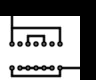

# Akiha-board

Akiha-board draws printed wiring board pattern by ASCII-art.

Input:
```
############
############
          ##
 +-----+  ##
 | +-+ |  ##
 ooooooo  ##
          ##
          ##
 opppppo  ##
 +-----+  ##
```

Output:



